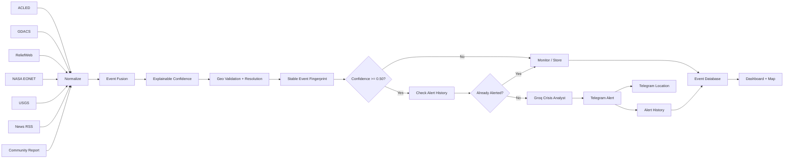

# Africa Crisis Intelligence

**AI-powered crisis monitoring, verification, mapping, and early warning for East Africa**

Africa Crisis Intelligence is an n8n-based crisis-intelligence workflow that collects signals from multiple public and humanitarian sources, normalizes them into a common event format, calculates an explainable confidence score, enriches higher-confidence events with AI-assisted analysis, stores event history, visualizes incidents on an interactive map, and sends analyst alerts through Telegram.

> **Hackathon prototype:** Built for the STP'26 Hackathon by Ejo Labs.

---

## Demo

### Dashboard


### n8n Workflow


### Telegram Alerts


### Telegram Location / Map Alert


> Replace the image files above with your own screenshots using the exact filenames shown, or change the paths in this README.

---

## Problem

Crisis information across East Africa is often fragmented across conflict databases, disaster platforms, humanitarian reports, news outlets, and local sources.

During a fast-moving emergency, analysts may need to monitor many different sources, determine whether multiple reports describe the same event, assess source reliability, identify where the event is happening, distinguish early-warning signals from verified events, avoid repeated alerts, and communicate the most important information quickly.

Africa Crisis Intelligence brings these steps into one automated and explainable workflow.

---

## Solution

```text
Collect
   ↓
Normalize
   ↓
Fuse Related Reports
   ↓
Geolocate
   ↓
Explainable Confidence Score
   ↓
AI-Assisted Analysis
   ↓
Deduplicate Alerts
   ↓
Store + Map + Notify
```

The AI model does **not** decide whether an event is true. Verification logic is applied before AI summarization.

---

## Key Features

- Multi-source crisis-data ingestion
- Conflict monitoring with ACLED
- Disaster monitoring with GDACS
- Humanitarian reporting with ReliefWeb
- Natural-hazard signals from NASA EONET
- Earthquake monitoring from USGS
- Open-source news monitoring
- Community-report webhook
- Event normalization and fusion
- Stable event fingerprints
- Explainable confidence scoring
- Geographic validation and resolution
- East Africa map visualization
- Persistent event history using n8n Data Tables
- Telegram analyst alerts
- Telegram location/map messages
- Duplicate Telegram alert suppression
- Groq rate-limit protection and fallback logic
- Search and filtering on the dashboard

---

## Current Geographic Scope

The hackathon version focuses on **East Africa**:

- Ethiopia
- Kenya
- Uganda
- Tanzania
- Rwanda
- Burundi
- South Sudan
- Somalia
- Djibouti
- Eritrea

The workflow can also be configured for:

```text
ACI_SCOPE = ETHIOPIA
ACI_SCOPE = EAST_AFRICA
ACI_SCOPE = AFRICA
```

For the hackathon demo, `EAST_AFRICA` is recommended.

---

## Data Sources

| Source | Purpose | Access |
|---|---|---|
| ACLED | Conflict and political-violence events | Account/API access |
| GDACS | Disaster alerts | Public |
| ReliefWeb | Humanitarian reporting | API app name required |
| NASA EONET | Natural events | Public |
| USGS | Earthquakes | Public |
| Google News RSS | Open-source news monitoring | Public RSS |
| Community Webhook | Local/community reports | Internal webhook |

---

## Explainable Confidence Score

Every fused event receives a confidence score from **0.00 to 1.00**.

| Component | Maximum |
|---|---:|
| Source credibility | 0.30 |
| Independent corroboration | 0.25 |
| Geographic agreement | 0.15 |
| Temporal agreement | 0.15 |
| Cross-source consistency | 0.15 |
| **Total** | **1.00** |

### Operational Thresholds

| Score | Status | Action |
|---|---|---|
| `< 0.40` | Low / Monitor | Store and continue monitoring |
| `0.40–0.49` | Needs Verification | Monitor and seek corroboration |
| `0.50–0.69` | Actionable / Analyze | Analyst alert + AI-assisted analysis |
| `≥ 0.70` | High / Verified | Higher-confidence intelligence |

The current hackathon alert threshold is **0.50**.

This does **not** mean that every event above 0.50 is fully verified. The platform separates an **analyst alert** from a **verified event**.

---

## Architecture



---

## Recommended Repository Structure

```text
africa-crisis-intelligence/
│
├── README.md
├── LICENSE
├── .gitignore
│
├── workflows/
│   └── africa_crisis_intelligence.json
│
├── dashboard/
│   └── index.html
│
├── docs/
│   ├── demo-script.md
│   └── images/
│       ├── dashboard.png
│       ├── n8n-workflow.png
│       ├── telegram-alerts.png
│       └── telegram-map.png
│
└── sample/
    └── community-report.json
```

---

## Environment / n8n Variables

Do **not** hard-code API keys in the workflow.

```text
ACI_SCOPE=EAST_AFRICA
ACI_WEBHOOK_TOKEN=your_secret_token

ACI_ACLED_USERNAME=your_acled_email
ACI_ACLED_PASSWORD=your_acled_password

ACI_GROQ_API_KEY=your_groq_api_key

ACI_TELEGRAM_BOT_TOKEN=your_telegram_bot_token
ACI_TELEGRAM_CHAT_ID=your_telegram_chat_id

ACI_RELIEFWEB_APPNAME=your_reliefweb_appname
```

### Security

Never commit API keys, passwords, Telegram bot tokens, webhook secrets, private credentials, or workflow exports containing secrets.

If a credential has previously appeared inside an exported workflow, rotate it before publishing the repository.

---

## Setup

### 1. Import the workflow

In n8n:

```text
Workflows → Import from File
```

Import:

```text
workflows/africa_crisis_intelligence.json
```

### 2. Configure variables

Add the required variables listed above.

### 3. Create persistent tables

Run:

```text
SETUP — Create Dashboard Storage
```

This creates:

```text
aci_events
aci_alerts
```

`aci_events` stores event history.

`aci_alerts` stores previously sent alerts so the workflow does not repeatedly send the same event to Telegram.

### 4. Activate the workflow

The current prototype runs every 30 minutes.

### 5. Open the dashboard

Use the production URL of:

```text
GET /aci-dashboard
```

The event API is available from:

```text
GET /aci-events
```

---

## Telegram Alert Logic

```text
New Event
   ↓
Stable Event ID
   ↓
Check aci_alerts
   ↓
Already sent?
 ┌─────┴─────┐
Yes          No
 ↓             ↓
Skip       Analyze
              ↓
          Send Alert
              ↓
       Save to aci_alerts
```

When valid geographic coordinates are available, Telegram can also receive a location pin before the descriptive crisis alert.

---

## Groq Rate-Limit Protection

The workflow includes protection against free-tier LLM rate limits:

- duplicate alerts are checked before LLM processing;
- previously alerted events can skip the LLM;
- requests are throttled;
- retries use backoff;
- LLM output length is limited; and
- the workflow can fall back to deterministic text if Groq is unavailable.

This prevents an LLM outage from stopping the full crisis-monitoring pipeline.

---

## Dashboard

The dashboard includes:

- recorded crisis count;
- analyst-alert count;
- crisis-type breakdown;
- countries represented;
- interactive map;
- confidence-based markers;
- regional event visualization;
- event search;
- crisis-type filtering;
- confidence filtering;
- event detail view;
- geographic precision;
- source information; and
- intelligence summaries.

### Example Demo Events

- reported drone strikes in Mekelle, Ethiopia;
- renewed tensions in Tigray;
- drought affecting Eritrea, Ethiopia, Kenya, and Somalia; and
- drought and food-security risk in Uganda's Karamoja region.

These examples demonstrate the workflow and are not a substitute for official operational alerts.

---

## Community Report Example

Endpoint:

```text
POST /webhook/aci-community-report
```

Header:

```text
X-ACI-Token: YOUR_TOKEN
```

Example body:

```json
{
  "event_type": "Flood",
  "country": "Kenya",
  "location": "Nairobi",
  "description": "Community report of severe flooding affecting roads."
}
```

---

## Responsible AI Design

Africa Crisis Intelligence is intentionally designed so that the LLM is **not the source of truth**.

The system:

1. collects source evidence;
2. normalizes reports;
3. groups potentially related events;
4. calculates an explainable confidence score;
5. validates geographic information; and
6. then uses AI to summarize the structured evidence.

The AI is instructed not to invent casualties, responsible actors, affected populations, government actions, or unsupported facts.

Human verification remains essential before operational decisions are made.

---

## Demo Video Flow

A recommended 3-minute demo:

```text
1. Problem
2. Dashboard overview
3. n8n architecture
4. Explainable confidence scoring
5. Mekelle/Tigray event example
6. Regional drought example
7. Telegram alert
8. Duplicate-alert suppression
9. East Africa scope
10. Impact and closing
```

Put the final narration in:

```text
docs/demo-script.md
```

---

## Current Prototype Limitations

This is a hackathon MVP.

Current limitations include:

- some news-based events rely on keyword/location extraction;
- geographic centroids may represent a region rather than an exact incident location;
- confidence scoring is rule-based and still requires validation;
- source availability and rate limits may affect coverage;
- cross-source event matching can be improved;
- multilingual support is planned but not yet fully implemented; and
- this system is not an official emergency-warning authority.

---

## Future Development

Planned improvements include:

- stronger semantic event matching;
- persistent cross-run evidence fusion;
- multilingual crisis intelligence;
- Amharic and additional African-language support;
- broader Africa coverage;
- organization-specific analyst dashboards;
- more advanced geospatial clustering;
- role-based alert routing;
- humanitarian partner integrations;
- incident timelines; and
- evidence provenance tracking.

---

## Vision

Africa Crisis Intelligence aims to help organizations move from:

```text
Fragmented crisis signals
        ↓
Verified situational awareness
        ↓
Faster human decision-making
```

The long-term goal is to support humanitarian organizations, public institutions, researchers, and communities with accessible, explainable, and locally relevant crisis intelligence.

---


---

## Author

**Dule Abera Bulti**

AI / Data Science / Computer Vision / Crisis Intelligence


