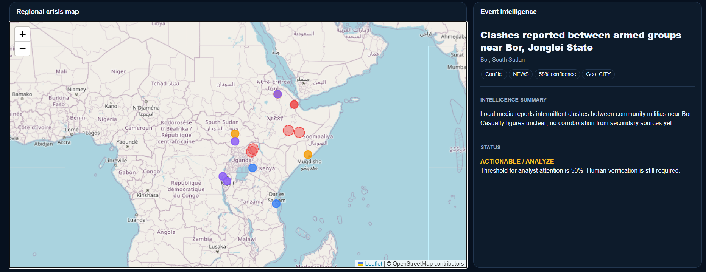
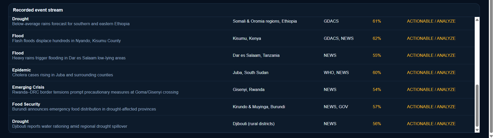
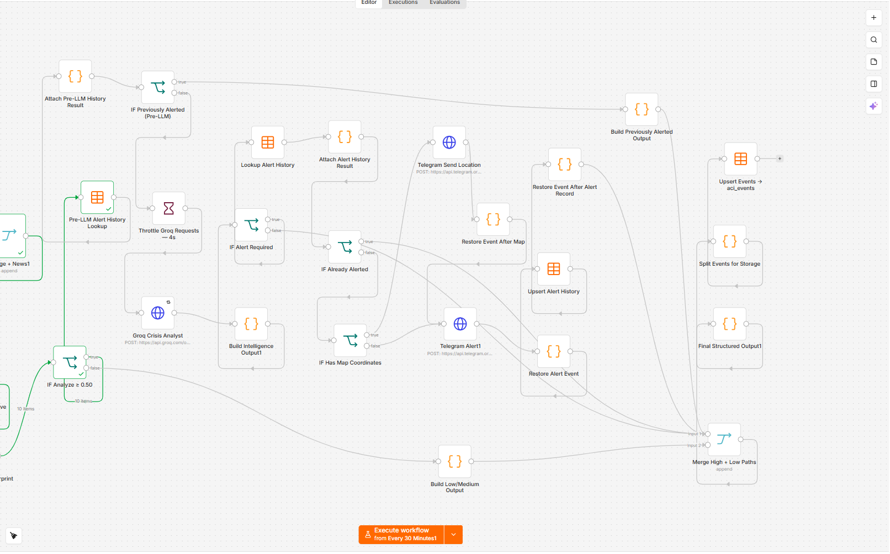
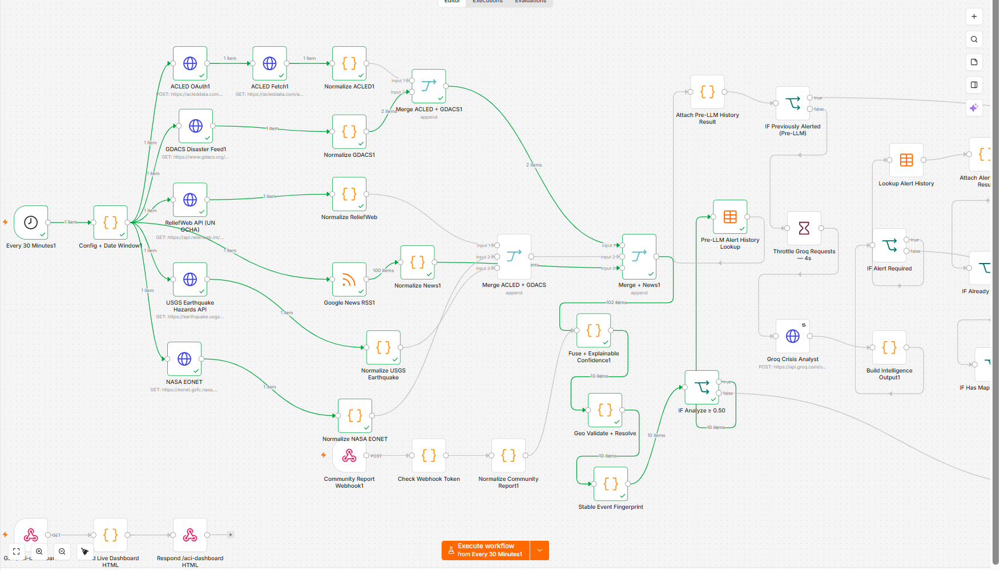
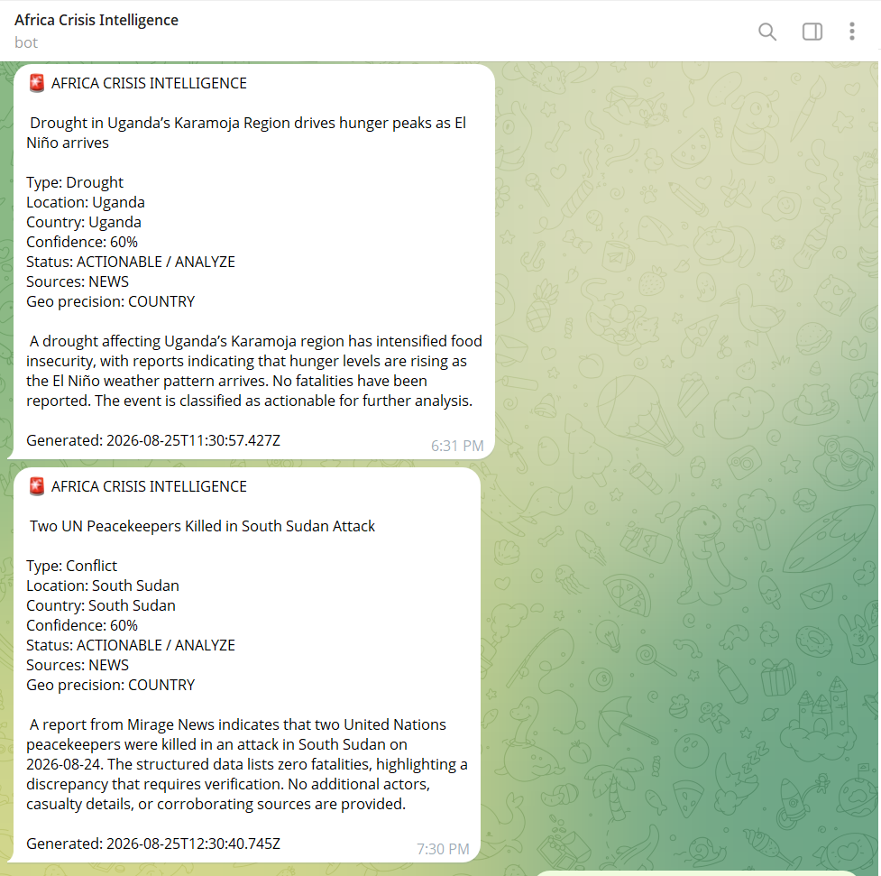

# Africa Crisis Intelligence

**AI-Powered Crisis Monitoring, Verification & Early Warning for East
Africa**

Africa Crisis Intelligence (ACI) is an early-stage crisis-intelligence
prototype developed for the **STP'26 Hackathon by Ejo Labs**. It
combines multi-source crisis monitoring, AI-assisted analysis,
explainable confidence scoring, geospatial visualization,
duplicate-event control, and Telegram alerts in one automated workflow.

> **Demo notice:** The dashboard includes a curated East Africa
> demonstration dataset to show how the platform can visualize and
> analyze regional crisis signals. Operational decisions require human
> verification.

## Problem

During disasters and emerging crises, information is fragmented across
news outlets, disaster feeds, government sources, and other channels.
Reports may be duplicated, incomplete, difficult to verify, or
geographically unclear. This makes rapid situational awareness difficult
for communities and response organizations.

## Solution

ACI converts fragmented reports into structured crisis intelligence:

**Sources → Normalize → Merge/Deduplicate → Confidence Scoring → AI
Analysis → Geolocation → Storage → Dashboard → Telegram Alerts**

The prototype currently focuses on East Africa while supporting a
longer-term vision for Sub-Saharan Africa.

## Core Features

-   Multi-source crisis ingestion, including news and GDACS-style
    disaster feeds
-   n8n-based workflow orchestration
-   AI-assisted crisis classification and summarization
-   Explainable confidence scoring
-   50% analyst-attention threshold for the hackathon prototype
-   Duplicate-event filtering to reduce repeated alerts
-   Geographic coordinates and location precision
-   Interactive Leaflet/OpenStreetMap dashboard
-   Search and filters by country, crisis type, source, and confidence
-   Telegram early-warning notifications
-   Structured event storage
-   Human-verification safeguards

## Repository Structure

``` text
Africa-Crisis-Intelligence/
├── README.md
├── workflow/
│   └── africa-crisis-intelligence-workflow.json
├── dashboard/
│   └── ACI_demo_dashboard_16_events.html
├── docs/
│   └── screenshots/
│       ├── dashboard-overview.png
│       ├── dashboard-detail.png
│       ├── map-dashboard.png
│       ├── event-table.png
│       ├── n8n-workflow-01.png
│       ├── n8n-workflow-02.png
│       └── telegram-alerts.png
└── demo/
    └── africa-crisis-intelligence-demo.mp4
```

## System Architecture

``` text
Crisis Data Sources
        |
        v
      n8n
        |
        +--> Source normalization
        +--> Event fusion / duplicate control
        +--> Explainable confidence scoring
        +--> AI crisis analysis
        +--> Geographic enrichment
        |
        v
 Structured Crisis Event
      /          \
     v            v
Dashboard     Telegram Alerts
```

## Dashboard

The dashboard provides a regional map, crisis-event stream, event
intelligence panel, confidence information, and filtering controls.






## n8n Workflow

The workflow automates ingestion, normalization, analysis, scoring,
storage, and alert delivery.





## Telegram Alerts

Events meeting the configured analyst-attention threshold can be routed
to Telegram with crisis type, location, confidence, source information,
and a short intelligence summary.



## Confidence & Verification

The prototype uses an explainable scoring approach rather than treating
a single AI output as verified truth. Signals can consider source
credibility, corroboration, geographic agreement, temporal agreement,
and cross-source consistency.

For the hackathon MVP, events at or above **0.50 confidence** can enter
the analyst-attention path. A qualifying score means **review/analyze**,
not automatically verified.

## Technology Stack

-   **n8n** --- workflow orchestration
-   **AI/LLM analysis** --- classification and structured crisis
    summaries
-   **JavaScript / HTML / CSS** --- dashboard
-   **Leaflet + OpenStreetMap** --- interactive mapping
-   **Telegram Bot** --- alert delivery
-   **JSON / structured event records** --- workflow and data
    interchange

## Demo

Watch the full demonstration video on
[Google Drive](https://drive.google.com/file/d/1z_iUPFZM-MyFGQGCaVV7aXgAvGwbIRk2/view?usp=sharing).

A repository copy is also available at
[`demo/africa-crisis-intelligence-demo.mp4`](demo/africa-crisis-intelligence-demo.mp4).

The demo shows the automated workflow, crisis intelligence output,
regional map, event dashboard, and Telegram alerting.

## Current Scope & Limitations

This is a hackathon-stage prototype, not an operational
emergency-warning authority. Some dashboard records are curated
demonstration events. Individual reports may be unverified, confidence
scoring is experimental, and AI-generated summaries can contain errors.
Human verification and authoritative sources remain essential before
operational decisions.

## Future Roadmap

Planned development includes stronger cross-source corroboration,
ACLED/conflict-data integration where licensing and API access permit,
broader trusted-source coverage, improved semantic duplicate detection,
multilingual support for African languages, institutional pilot testing,
and expansion from East Africa toward Sub-Saharan Africa.

## Project Vision

Africa Crisis Intelligence aims to make crisis information easier to
discover, verify, understand, map, and communicate so that African
institutions and communities can develop faster and better-informed
responses to disasters and emerging crises.

